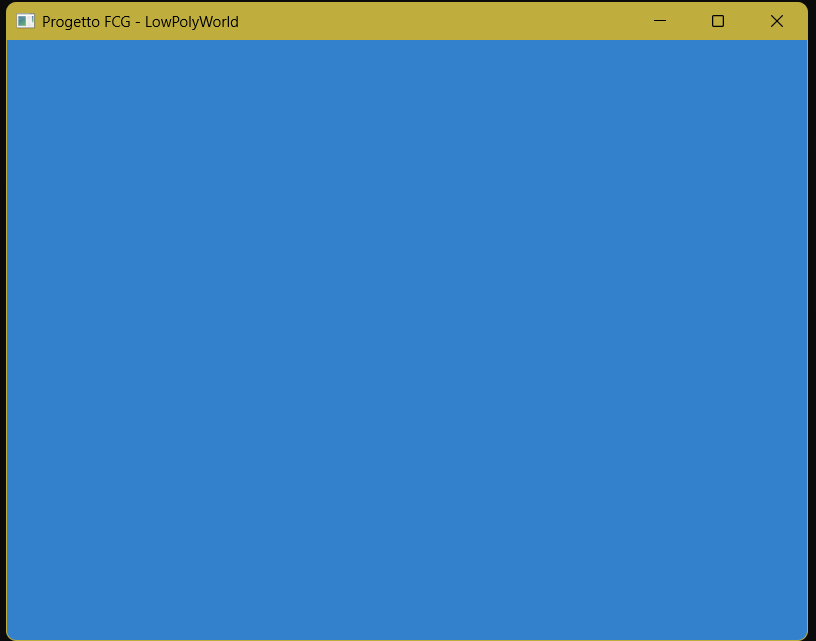

# Tappa 01: Inizializzazione Finestra e Contesto OpenGL

## Obiettivo
Il primo step del progetto è consistito nel gettare le fondamenta dell'applicazione grafica. L'obiettivo era inizializzare un contesto OpenGL 4.1 Core Profile e generare una finestra di rendering funzionante utilizzando la libreria SFML (aggiornata alla versione 3.0), pulendo i buffer grafici per ottenere uno schermo a tinta unita (azzurro cielo).

## Comandi per il Giocatore
In questa fase non sono previsti comandi interattivi per l'utente, eccezione fatta per la chiusura della finestra tramite il pulsante standard del sistema operativo o l'interruzione del processo.

## Problemi Riscontrati e Soluzioni
Durante la primissima fase di test, il codice compilava correttamente generando l'eseguibile, ma all'avvio il programma andava in crash senza mostrare alcuna finestra. 
Analizzando il problema, è emerso che l'eseguibile non riusciva a trovare le librerie dinamiche (i file `.dll` di SFML) necessarie per il runtime, poiché queste si trovavano in una cartella separata rispetto all'output della build.
Invece di costringere l'utente a copiare manualmente i file a ogni compilazione, è stato risolto il problema alla radice intervenendo sul sistema di build. È stato inserito un comando `if(EXISTS "${CMAKE_CURRENT_SOURCE_DIR}/librerie/SFML/bin")` all'interno del `CMakeLists.txt`: in questo modo, nel caso non le trovasse, CMake copia in automatico tutte le `.dll` necessarie direttamente nella cartella di destinazione dell'eseguibile, garantendo un avvio immediato e "plug-and-play".**

**Soluzione in seguito risultata superflua per via del nuovo CMakeList,il quale forza SFML a fondersi dentro l'eseguibile non avendo più file .dll.

## Screenshot

---