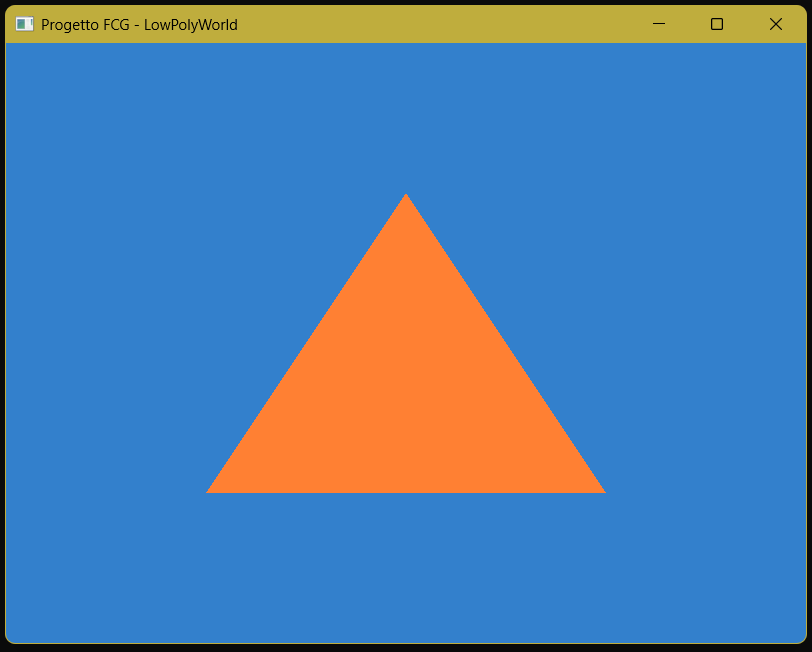

# Tappa 02: La Pipeline Grafica e il Primo Poligono

## Istruzioni di Build
Per avviare questa specifica tappa, assicurarsi di aver impostato sia il *Build Target* che il *Launch Target* su `Tappa02` tramite gli strumenti di CMake.

## Obiettivo
Una volta stabilito il contesto grafico, l'obiettivo è stato quello di attivare la pipeline programmabile di OpenGL. Ho implementato un Vertex Shader e un Fragment Shader base direttamente all'interno del codice sorgente. Successivamente, ho definito le coordinate spaziali di tre vertici e le ho inviate alla memoria della GPU tramite un Vertex Buffer Object (VBO) e un Vertex Array Object (VAO), istruendo OpenGL su come interpretare i dati per renderizzare un singolo triangolo colorato al centro dello schermo.

## Comandi per il Giocatore
Come per la Tappa 01, la scena è statica e non prevede ancora input da parte dell'utente.

## Problemi Riscontrati e Soluzioni
Dal punto di vista del codice C++ e degli shader, l'implementazione è stata fluida. Tuttavia, ho riscontrato un problema ambientale legato all'editor (VS Code) e alla gestione dei target di CMake. Avendo strutturato il `CMakeLists.txt` per mantenere gli eseguibili delle tappe precedenti, VS Code continuava di default a eseguire il *Launch Target* della Tappa 01, mostrandomi a schermo il risultato del codice vecchio e ignorando la build aggiornata.
Ho risolto il blocco bypassando l'interfaccia grafica inferiore di VS Code e utilizzando la *Command Palette*. Tramite i comandi `CMake: Select Launch Target` e `CMake: Select Default Build Target`, ho forzato l'editor a puntare rigorosamente al nuovo eseguibile della Tappa 02, permettendomi di visualizzare correttamente il rendering del triangolo.

## Screenshot

---