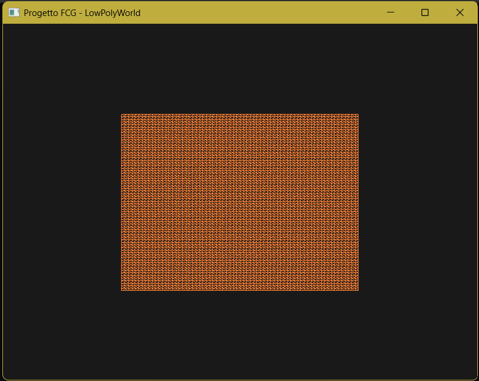

# Tappa 03: Caricamento del DEM e Rendering in Wireframe

## Istruzioni di Build
Per avviare questa specifica tappa, assicurarsi di aver impostato sia il *Build Target* che il *Launch Target* su `Tappa03` tramite gli strumenti di CMake.

## Obiettivo
L'obiettivo di questa tappa era l'integrazione del parser fornito dal docente (`dem.hh` / `dem.cc`) per leggere i dati altimetrici reali del ghiacciaio dell'Aletsch dal file `.asc` e visualizzarli a schermo sotto forma di griglia tridimensionale utilizzando la modalità **Wireframe** (`GL_LINE`).

## Comandi per il Giocatore
Come per la Tappa 02, la scena è statica e non prevede ancora input da parte dell'utente.

## Problematica Riscontrata: Eccesso di Densità (Il Muro Arancione)
Una volta avviato il rendering iniziale, l'output a schermo non mostrava una rete geometrica definita, bensì un blocco solido e monocromatico di colore arancione. 

### Analisi del problema
Il file DEM originale presenta una risoluzione di $703 \times 703$ vertici. Cercando di mappare l'intera griglia all'interno di una finestra standard di $800 \times 600$ pixel, lo spazio fisico tra un vertice e l'altro si è ridotto all'ordine del singolo pixel. Le linee del wireframe erano talmente fitte e ravvicinate che il monitor e l'occhio le fondevano in un'unica massa densa, annullando la percezione dei rilievi e sovraccaricando inutilmente la CPU e la GPU.

## Soluzione Adottata: Level of Detail (LOD) tramite Sfoltimento
Per risolvere il problema dell'eccesso di densità e rendere visibile la struttura geometrica della montagna, si è applicato il concetto di **LOD (Level of Detail)** direttamente in fase di campionamento:

1. **Passo di campionamento (`step = 10`):** Invece di leggere ogni singolo vertice del file `.asc`, i cicli di generazione della mesh saltano i punti intermedi, leggendo ed elaborando **un solo vertice ogni 10**.
2. **Ricalcolo della griglia:** Il numero di colonne e righe effettive è stato ridotto dinamicamente tramite la formula:
   `int cols = (W + step - 1) / step;`
   `int rows = (H + step - 1) / step;`
3. **Risultato:** La mesh risultante è diventata leggermente più "Low-Poly", riducendo drasticamente il numero di poligoni. Questo ha permesso di separare nettamente le linee del wireframe, rivelando l'andamento tridimensionale di valli e picchi.

## Screenshot
