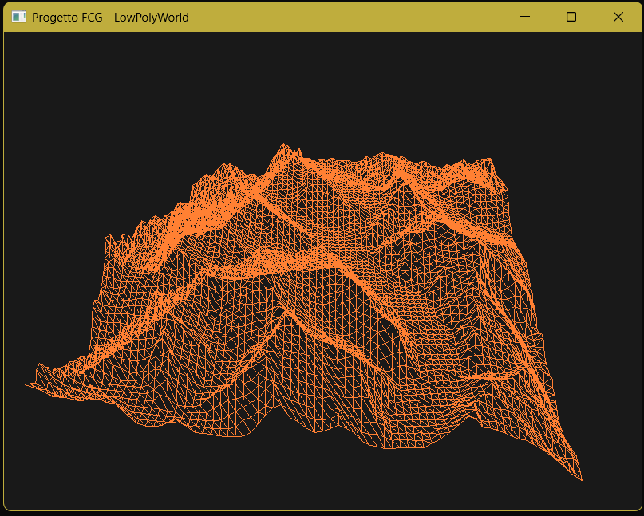

# Tappa 04: Introduzione delle Matrici 3D (GLM) e Gestione Finestra

## Istruzioni di Build
Per avviare questa specifica tappa, assicurarsi di aver impostato sia il *Build Target* che il *Launch Target* su `Tappa04` tramite gli strumenti di CMake.

---

## Obiettivo
L'obiettivo di questa tappa era l'abbandono dello spazio bidimensionale statico attraverso l'introduzione delle trasformazioni geometriche 3D (matrici *Model*, *View* e *Projection* via **GLM**) per simulare l'inquadratura prospettica da una telecamera.

## Comandi per il Giocatore
Come per la Tappa 03, la scena è statica e non prevede ancora input da parte dell'utente.

## Problematica 1: Errore di Compilazione GLM (La sottocartella di troppo)
Al momento dell'inclusione degli header di GLM tramite l'istruzione `#include <glm/glm.hpp>`, il compilatore ha restituito un errore fatale di file non trovato (*No such file or directory*), bloccando immediatamente il processo di build.

### Analisi e Soluzione
Il problema risiedeva nell'organizzazione delle cartelle della libreria *header-only*. La configurazione di CMake cercava i file nel percorso `librerie/glm`, ma la struttura estratta originariamente conteneva un livello di annidamento ridondante (una sottocartella `glm` dentro un'altra cartella `glm`). 

Il problema è stato risolto ristrutturando la directory in modo rigido e allineandola alle aspettative di CMake e del preprocessore C++:

```text
Progetto_FCG/
└── librerie/
    └── glm/             <-- Path intercettato da CMake
        └── glm/         <-- Sottocartella contenente i file .hpp
            ├── glm.hpp
            └── gtc/
```

Una volta rimosso il livello di cartelle di troppo, il compilatore ha individuato correttamente gli header matematici superando il blocco.

---

## Problematica 2: Centratura al Ridimensionamento della Finestra
Nelle scorse tappe la finestra veniva avviata con un comando fisso `glViewport(0, 0, 800, 600)`. Massimizzando la finestra a schermo intero o modificando le dimensioni della finestra di SFML, la montagna rimaneva bloccata in un riquadro fisso nell'angolo in basso a sinistra (l'origine del sistema di coordinate di OpenGL), lasciando il resto dello schermo completamente vuoto e nero. Inoltre, il soggetto subiva una vistosa deformazione geometrica (stiramento).

### Soluzione Adottata
Per garantire che il soggetto rimanesse sempre centrato e proporzionato a qualsiasi risoluzione, sono state implementate due modifiche logiche all'interno del Game Loop:

1. **Viewport Dinamico:** È stato intercettato l'evento di ridimensionamento di SFML (`sf::Event::Resized`) per aggiornare l'area di disegno di OpenGL in tempo reale con le nuove dimensioni della finestra:
   ```cpp
   glViewport(0, 0, resized->size.x, resized->size.y);
   ```

2. **Aspect Ratio Variabile:** La matrice di proiezione prospettica (`glm::perspective`) è stata modificata per non usare più un valore fisso, ma per calcolare l'Aspect Ratio corrente dividendo la larghezza per l'altezza effettive della finestra ad ogni singolo frame:
   ```cpp
   float aspectRatio = currentWidth / currentHeight;
   glm::mat4 projection = glm::perspective(glm::radians(45.0f), aspectRatio, 0.1f, 100.0f);
   ```

Grazie a queste correzioni, il ghiacciaio mantiene le sue proporzioni reali e la perfetta centratura indipendentemente dalle manipolazioni della finestra da parte dell'utente.

## Screenshot

