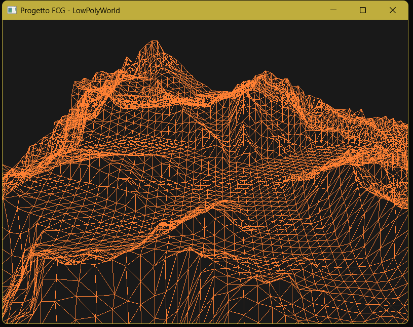

# Tappa 05: Telecamera Libera e Controlli "Drone"

## Istruzioni di Build
Per avviare questa specifica tappa, assicurarsi di aver impostato sia il *Build Target* che il *Launch Target* su `Tappa05` tramite gli strumenti di CMake.

---

## Obiettivo
L'obiettivo di questa tappa era implementare un sistema di navigazione 3D interattivo. Attraverso l'uso delle matrici di trasformazione, si è fornita all'utente la possibilità di esplorare la mesh altimetrica muovendosi liberamente con la tastiera (traslazione su 3 assi) e orientando lo sguardo con il mouse (imbardata e beccheggio). Come da specifica architetturale, l'asse di rollio è stato bloccato per simulare un comportamento da "drone" e prevenire capovolgimenti irrealistici.

## Comandi per il Giocatore
A differenza delle tappe precedenti, la scena è ora completamente esplorabile in tempo reale. I comandi a disposizione sono:
* **Mouse**: Orienta lo sguardo della telecamera (Imbardata/Yaw e Beccheggio/Pitch).
* **W / S**: Traslazione in avanti e all'indietro rispetto allo sguardo.
* **A / D**: Traslazione laterale (Strafe) a sinistra e a destra.
* **Spazio**: Traslazione assoluta positiva verso l'alto (aumento di quota sull'asse Z).
* **Shift Sinistro**: Traslazione assoluta negativa verso il basso (picchiata sull'asse Z).
* **TAB**: Sblocca/Blocca il cursore del mouse, permettendo di interagire con la finestra di sistema (es. per il ridimensionamento).
* **ESC**: Chiude istantaneamente l'applicazione.

---

## Problematica 1: Loop degli Eventi e "Ghost Drifting"
Nelle prime iterazioni, la telecamera tendeva a muoversi in modo autonomo ("ghost drifting") anche quando il mouse era fermo. 

### Analisi e Soluzione
Il problema risiedeva nell'uso dell'evento `sf::Event::MouseMoved` all'interno del loop degli eventi. L'istruzione utilizzata per mantenere il cursore bloccato al centro dello schermo (`sf::Mouse::setPosition`) veniva interpretata dal sistema operativo come un *nuovo* movimento del mouse, innescando un ciclo di feedback infinito tra lettura e riposizionamento.
La soluzione ha previsto l'estrazione della logica di tracciamento al di fuori del ciclo `pollEvent`. Il mouse viene ora interrogato direttamente ad ogni frame tramite `sf::Mouse::getPosition(window)`, e l'hardware viene ricentrato solo in presenza di un delta di movimento reale (diverso da zero), spezzando così il loop di feedback.

---

## Problematica 2: Sensibilità Asimmetrica e Inversione Assi
Durante i test di navigazione sono emersi due problemi di ergonomia nei controlli di puntamento:
1. Movendo il mouse a destra, la telecamera ruotava a sinistra (Asse X invertito).
2. Il movimento verticale (Pitch) risultava eccessivamente nervoso e ipersensibile rispetto alla rotazione orizzontale (Yaw), rendendo difficile inquadrare dettagli vicini.

### Soluzione Adottata
L'inversione dell'asse X è stata risolta banalmente passando da una somma a una sottrazione nel calcolo dell'angolo di Yaw.
Per la sensibilità, si è deciso di disaccoppiare matematicamente le velocità di rotazione sui due assi, dichiarando variabili globali separate:
```cpp
float yawSensitivity   = 0.1f;
float pitchSensitivity = 0.08f;
```
Attenuando il fattore di moltiplicazione sull'asse Y, è stato possibile garantire una rotazione panoramica rapida pur mantenendo un controllo millimetrico e stabile sull'inclinazione verticale.

---

## Problematica 3: Libertà Verticale Limitata
I controlli direzionali standard (WASD) traslavano la telecamera calcolando i vettori relativi allo sguardo (*Front* e *Right*). Questo costringeva l'utente a guardare fisicamente in alto o in basso per variare la propria altitudine, rendendo complesse le manovre di volo stazionario.

### Soluzione Adottata
Per garantire un'esplorazione ottimale, sono state introdotte due scorciatoie da tastiera (Spazio e Shift) svincolate dal vettore di sguardo e legate esclusivamente al vettore globale `Up` (corrispondente all'asse Z del sistema geografico). Questo permette di variare l'altitudine in modo assoluto e indipendente da dove si sta guardando, in modo analogo alla modalità creativa di molti applicativi tridimensionali.

---

## Screenshot

