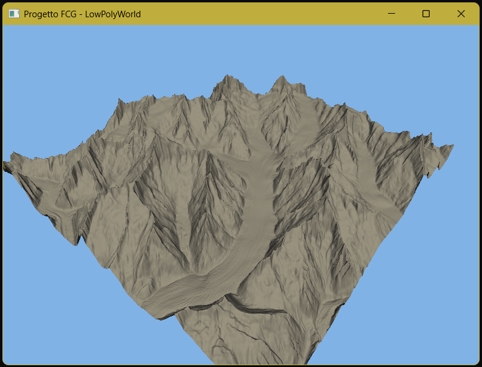

# Tappa 06: Illuminazione Solid Low-Poly e Modello di Phong

## Istruzioni di Build
Per avviare questa specifica tappa, assicurarsi di aver impostato sia il *Build Target* che il *Launch Target* su `Tappa06` tramite gli strumenti di CMake.

---

## Obiettivo
L'obiettivo di questa tappa era abbandonare definitivamente la visualizzazione a reticolo vuoto passata e "accendere il sole" sul ghiacciaio. Per farlo, si è passati alla modalità di riempimento dei poligoni (`GL_FILL`) e si è implementato il modello di illuminazione di Phong (componente ambientale e diffusa) direttamente nel Fragment Shader. Questo ha richiesto il calcolo matematico dei vettori normali per ogni singolo vertice della griglia tramite il prodotto vettoriale delle tangenti.

## Comandi per il Giocatore
I comandi di volo e gestione ereditati e consolidati dalla Tappa 05 rimangono completamente attivi:
* **Mouse**: Orienta lo sguardo della telecamera (Imbardata/Yaw e Beccheggio/Pitch).
* **W / S**: Traslazione in avanti e all'indietro rispetto allo sguardo.
* **A / D**: Traslazione laterale (Strafe) a sinistra e a destra.
* **Spazio**: Traslazione assoluta positiva verso l'alto (aumento di quota).
* **Shift Sinistro**: Traslazione assoluta negativa verso il basso (picchiata).
* **TAB**: Sblocca/Blocca il cursore del mouse per consentire l'interazione con la finestra.
* **ESC**: Chiude istantaneamente l'applicazione.

---

## Problematica 1: Ottimizzazione della Risoluzione della Mesh (Riduzione dello Step)
Nelle tappe precedenti (in particolare nella Tappa 03), l'utilizzo della risoluzione nativa del file generava un ammasso illeggibile di linee sovrapposte, battezzato "muro arancione". Per ovviare al problema, eravamo stati costretti ad applicare un campionamento molto rado impostando `step = 10`. 

### Analisi e Soluzione
Con il passaggio alla modalità solida (`GL_FILL`) coadiuvata dal calcolo delle luci e delle ombre, il vincolo visivo della sovrapposizione delle linee è completamente decaduto. È stato quindi possibile abbassare drasticamente il valore del passo fino a **`step = 1`**. 

Questo decremento ha permesso di caricare l'intera matrice altimetrica originale dell'Aletsch a pieno dettaglio (pari a 489.991 vertici e quasi un milione di triangoli). La scheda video non deve più disegnare linee adiacenti che si fondono, ma riempie facce solide orientate nello spazio. La riduzione dello step ha così sbloccato la risoluzione geografica reale del file sorgente, rivelando l'esatta morfologia affilata delle creste montuose e la maestosità della Konkordiaplatz senza alcun artefatto visivo.

## Screenshot

