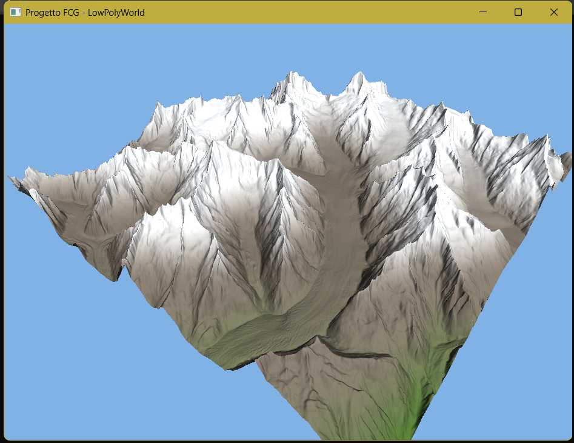

# Tappa 07: Colorazione Procedurale e Modulazione dell'Altitudine

## Istruzioni di Build
Per avviare questa specifica tappa, assicurarsi di aver impostato sia il *Build Target* che il *Launch Target* su `Tappa07` tramite gli strumenti di CMake.

---

## Obiettivo
L'obiettivo di questa tappa era rompere la monotonia cromatica del blocco di roccia grigia introdotto nella Tappa 06, implementando una **colorazione procedurale dinamica basata sull'altitudine** direttamente all'interno del Fragment Shader. Sfruttando la coordinata verticale `FragPos.z` interpolata per ogni singolo frammento, la scheda video calcola in tempo reale il bioma di appartenenza (fondovalle vegetato, roccia viva granitica o picchi innevati) e sfuma i colori nativamente tramite le funzioni GLSL `smoothstep` e `mix`.

## Comandi per il Giocatore
I comandi di volo tridimensionale e di sblocco dell'interfaccia rimangono invariati rispetto alle tappe precedenti:
* **Mouse**: Orienta lo sguardo della telecamera (Imbardata/Yaw e Beccheggio/Pitch).
* **W / S**: Traslazione in avanti e all'indietro rispetto allo sguardo.
* **A / D**: Traslazione laterale (Strafe) a sinistra e a destra.
* **Spazio**: Traslazione assoluta positiva verso l'alto (aumento di quota).
* **Shift Sinistro**: Traslazione assoluta negativa verso il basso (picchiata).
* **TAB**: Sblocca/Blocca il cursore del mouse per consentire l'interazione con la finestra di sistema (es. massimizzazione a schermo intero).
* **ESC**: Chiude istantaneamente l'applicazione.

---

## Problematica 1: Ottimizzazione del Contrasto Visivo per la Presentazione Accademica
Nelle prime build di questa tappa, la soglia di transizione tra il fondovalle (erba) e la mezza costa (roccia) era impostata a una quota molto bassa (`FragPos.z = -0.05`). Di conseguenza, l'estensione del ghiacciaio dell'Aletsch tendeva a presentarsi quasi interamente grigia e bianca, nascondendo l'effetto del gradiente procedurale e rendendo l'impatto complessivo simile a quello della tappa precedente.

### Analisi e Soluzione
Per massimizzare il feedback visivo e valorizzare il lavoro algoritmico agli occhi della commissione d'esame, si è optato per una ritaratura strategica delle quote geologiche all'interno del codice GLSL:
1. **Innalzamento della soglia:** Il limite massimo del bioma vallivo è stato spinto verso l'alto, spostando il controllo condizionale da `-0.05` a **`0.02`**. In questo modo, il verde risale sensibilmente lungo i costoni e i canaloni laterali.
2. **Saturazione cromatico-procedurale:** Il vettore `colorValley` è stato potenziato nel canale *Green* (passando da `0.35f` a `0.45f`) per conferirgli maggiore vivacità.
3. **Morbidezza del gradiente:** I parametri della funzione `smoothstep(-0.2, 0.02, FragPos.z)` sono stati ricalcolati per spalmare la transizione su un dislivello più ampio, garantendo un passaggio naturale e privo di banding tra i prati di fondovalle e le pareti di granito nudo che precedono le nevi perenni.

## Screenshot

