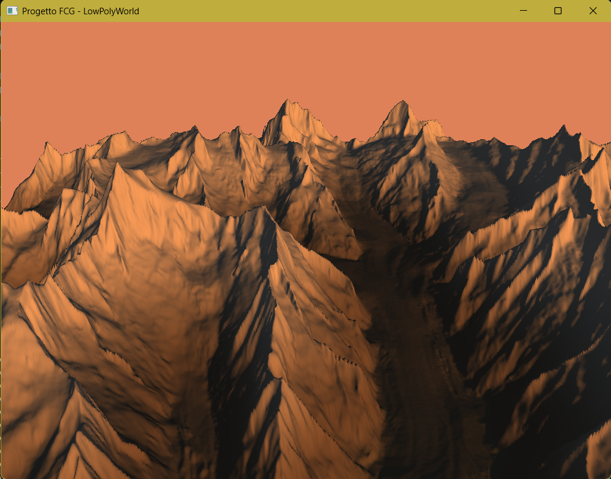
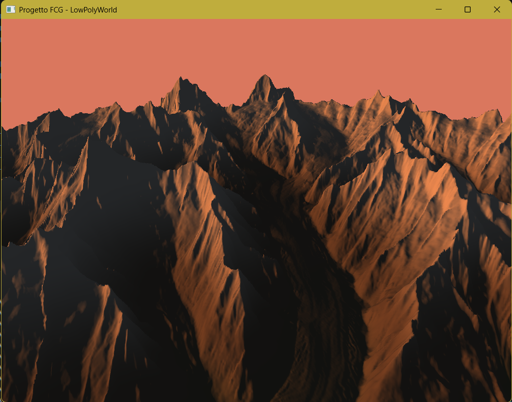

# Tappa 08: Ciclo Giorno/Notte Avanzato e Luce Direzionale Dinamica

## Istruzioni di Build
Per avviare questa specifica tappa, assicurarsi di aver impostato sia il *Build Target* che il *Launch Target* su `Tappa08` tramite gli strumenti di CMake.

---

## Obiettivo
L'obiettivo di questa tappa era trasformare l'illuminazione statica della scena in un sistema dinamico di tempo atmosferico e temporale realistico. Sganciando il vettore della luce, l'intensità ambientale e i colori del cielo da valori fissi, si è implementato un ciclo giorno/notte completo guidato dal tempo reale di esecuzione. La scheda video calcola l'orbita solare tramite funzioni trigonometriche e interpola in tempo reale una ricca tavolozza cromatico-atmosferica (giorno pieno, golden hour, tramonto/enrosadira, ora blu e notte alpina) sfruttando interpolazioni curvilinee non lineari per garantire la massima morbidezza visiva.

## Comandi per il Giocatore
I controlli di navigazione tridimensionale rimangono attivi e ottimizzati. La gestione della velocità o del blocco temporale è predisposta a livello di variabili e verrà esposta in futuro nell'HUD:
* **Mouse**: Orienta lo sguardo della telecamera (Imbardata/Yaw e Beccheggio/Pitch).
* **W / S**: Traslazione in avanti e all'indietro rispetto allo sguardo relative al drone.
* **A / D**: Traslazione laterale (Strafe) a sinistra e a destra.
* **Spazio**: Traslazione assoluta positiva verso l'alto (aumento di quota sull'asse Z).
* **Shift Sinistro**: Traslazione assoluta negativa verso il basso (picchiata sull'asse Z).
* **TAB**: Sblocca/Blocca il cursore del mouse per l'interazione con l'interfaccia o la finestra di sistema.
* **P**: Attiva/Disattiva la pausa dello scorrere del tempo del ciclo giorno/notte.
* **ESC**: Chiude istantaneamente l'applicazione.

---

## Problematica 1: Transizioni Cromatiche Piattelineari e Mancanza di Realismo Atmosferico
Nelle prime iterazioni del ciclo, la variazione luminosa risultava sgradevole e artificiale. Il passaggio tra il giorno e la notte ricordava un semplice "interruttore" cromatico o una dissolvenza lineare rigida, priva delle caratteristiche sfumature dei tramonti d'alta quota (come il fenomeno dell'Enrosadira o l'Alpenglow sui ghiacciai).

### Analisi e Soluzione
Il problema risiedeva nell'uso di una palette colori troppo povera (solo 3 stati) associata a un'interpolazione strettamente lineare (`glm::mix` pura). Nella realtà, l'atmosfera filtra la luce solare secondo curve non lineari, attraversando fasi chimico-fisiche ben distinte. 
La soluzione ha previsto una ristrutturazione profonda dell'algoritmo nel ciclo principale:
1. **Espansione della Tavolozza:** Sono state isolate cinque fasi distinte del cielo alpino (`skyDay`, `skyGoldenHour`, `skySunset` con tonalità magenta/rosa, `skyTwilight` per l'ora blu, e `skyNight`).
2. **Introduzione di Smoothstep:** L'interpolazione lineare è stata corretta vincolando il coefficiente di transizione `t` tramite la funzione non lineare `glm::smoothstep`. Questo ha azzerato gli scatti cromatici, garantendo che l'inizio e la fine di ogni transizione avvengano con una decelerazione morbida e fotorealistica.

---

## Problematica 2: Velocità del Ciclo Giorno/Notte Eccessiva (`daySpeed`)
Nelle primissime run di test, il moltiplicatore che gestiva lo scorrere del tempo globale era impostato su un valore troppo alto. Di conseguenza, il sole "sfrecciava" sulla mappa causando uno sfarfallio nervoso e innaturale delle ombre sui crinali rocciosi. Inoltre, questa eccessiva velocità impediva di apprezzare le delicate transizioni atmosferiche avanzate (come l'Enrosadira o l'ora blu), che duravano a malapena qualche frazione di secondo a schermo.

### Analisi e Soluzione
Per risolvere il problema e stabilizzare l'impatto visivo si è intervenuti sul bilanciamento della simulazione, isolando e riducendo la variabile `daySpeed` a un valore di `0.1f`. Questo tuning ha regolarizzato l'orbita solare, garantendo una progressione luminosa morbida e cinematografica che permette all'osservatore di percepire in modo chiaro l'evoluzione del bioma e la corretta propagazione della luce diffusa.

---

## Problematica 3: Necessità di Ispezione Statica dell'Illuminazione (Freeze del Tempo)
Durante le fasi di debugging visivo o nella necessità di catturare screenshot della mesh in specifiche condizioni di luce (es. per allegare documentazione sul tramonto o sul mezzogiorno perfetto), rincorrere il movimento orbitale continuo della luce direzionale risultava impraticabile, forzando lo sviluppatore a riavviare continuamente l'applicazione sperando di beccare il frame corretto.

### Analisi e Soluzione
Per svincolare l'ispezione della scena dallo scorrere del tempo reale, è stata implementata una modifica architetturale nel calcolo del tempo della simulazione. Si è rimosso il tracciamento basato sul clock assoluto di sistema ed è stata introdotta una variabile di stato booleana `isTimePaused` legata al tasto **P**. 

Nel loop di rendering, l'angolo di inclinazione del sole (`currentSunAngle`) viene ora incrementato tramite l'accumulo del `deltaTime` hardware solo se il flag di pausa è disattivato:
```cpp
if (!isTimePaused) {
    currentSunAngle += deltaTime * daySpeed;
}
```
Questa implementazione consente di congelare istantaneamente l'intera configurazione fotometrica della volta celeste a schermo senza bloccare i thread legati alla navigazione del drone (WASD e mouse), permettendo di perlustrare la mesh statica sotto qualsiasi specifica inquadratura oraria.

## Screenshot



