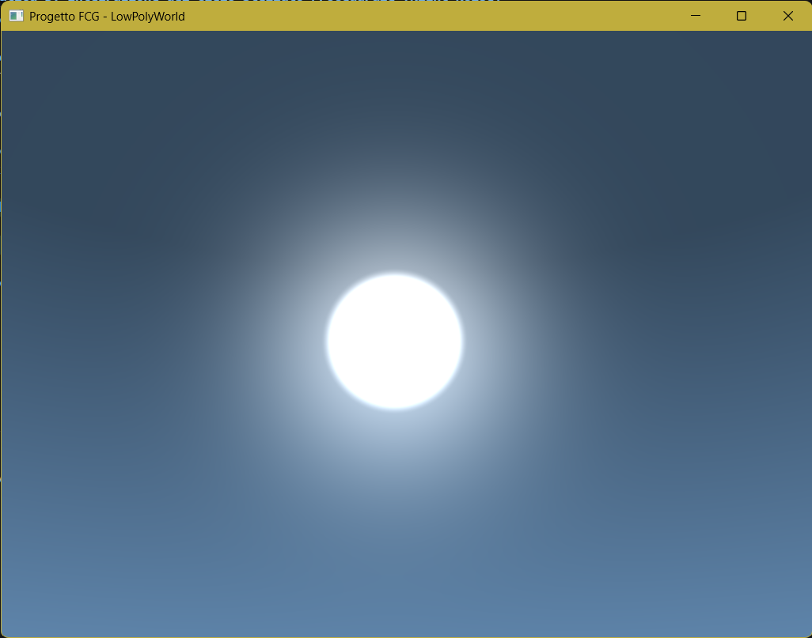
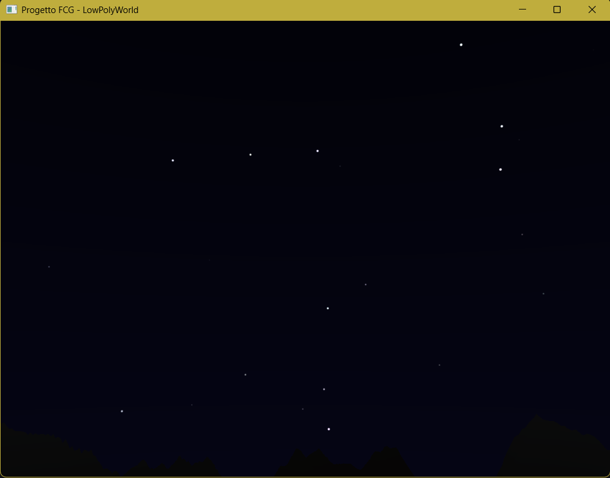

# Tappa 09: Skybox Procedurale e Calcolo del Disco Solare

## Istruzioni di Build
Per avviare questa specifica tappa, assicurarsi di aver impostato sia il *Build Target* che il *Launch Target* su `Tappa09` tramite gli strumenti di CMake.

---

## Obiettivo
L'obiettivo di questa tappa era sigillare l'ambiente di gioco all'interno di una volta celeste fotorealistica, sostituendo il colore di sfondo piatto della Tappa 08 con un **Skybox Procedurale** dinamico. Invece di utilizzare texture precaricate, il motore grafico disegna ora un cubo gigantesco attorno alla telecamera e calcola il colore del cielo, la gradazione orizzonte-zenit e la posizione fisica del disco solare e delle stelle direttamente nello shader, frame per frame, in sincronia con il ciclo giorno/notte della Tappa 08.

## Comandi per il Giocatore
I controlli di navigazione tridimensionale, di pausa del tempo e di sblocco dell'interfaccia rimangono consolidati e attivi:
* **Mouse**: Orienta lo sguardo della telecamera (Imbardata/Yaw e Beccheggio/Pitch).
* **W / S**: Traslazione in avanti e all'indietro relative al drone.
* **A / D**: Traslazione laterale (Strafe) a sinistra e a destra.
* **Spazio**: Traslazione assoluta positiva verso l'alto.
* **Shift Sinistro**: Traslazione assoluta negativa verso il basso.
* **TAB**: Sblocca/Blocca il cursore del mouse per l'interazione con l'interfaccia.
* **P**: Attiva/Disattiva la pausa dello scorrere del tempo del ciclo giorno/notte.
* **ESC**: Chiude istantaneamente l'applicazione.

---

## Problematica 1: Illusione di Infinità della Volta Celeste (View Matrix Breaking)
Uno Skybox deve comportarsi come il cielo reale: non si deve mai poter raggiungere il suo bordo traslando all'interno della scena. Nella prima implementazione, lo Skybox veniva disegnato come un normale cubo fisso nella scena, e muovendo il drone ci si poteva "scontrare" con le sue facce, rompendo l'illusione atmosferica.

### Analisi e Soluzione
Per creare l'illusione di infinità, si è applicato un trucco algebrico nella View Matrix dello Skybox. Prima di passare la matrice della telecamera allo shader, si è creata una versione "castrata" rimuovendo brutalmente la componente di traslazione (la parte posizionale). 

In C++:
```cpp
// Creiamo una View Matrix che non ha più la posizione XYZ, ma solo la rotazione
glm::mat4 viewSkybox = glm::mat4(glm::mat3(view));
```
In questo modo, lo Skybox viene disegnato sempre centrato perfettamente sulla telecamera. Quando il giocatore si muove con WASD, il drone trasla, ma lo Skybox "lo insegue" istantaneamente, facendo percepire che le montagne si muovono mentre il cielo e le stelle rimangono fissi all'infinito.

---

## Problematica 2: Disegno Procedurale del Sole e Bagliore Atmosferico
Si è dovuta implementare la matematica per generare il disco solare visibile (sun disk) e il bagliore circostante (sun glow) in base al vettore della luce direzionale, evitando l'uso di texture.

### Soluzione Adottata
La logica è stata implementata nel Fragment Shader dello Skybox. Si calcola il prodotto vettoriale (Dot Product) tra la direzione di ogni pixel del cielo e il vettore luce attuale.
```glsl
float sunDot = dot(dir, normalize(lightDir));
// Il glow è una curva di potenza basata sul Dot Product
float sunGlow = pow(max(sunDot, 0.0), 64.0);
// Il disco è un cerchio netto creato con smoothstep a valori molto alti
float sunDisk = smoothstep(0.995, 0.998, sunDot);
```
Questa tecnica ha permesso di ottenere un sole sferico e accecante, circondato da un'atmosfera calda che si infiamma di magenta/arancione al tramonto, perfettamente sincronizzato con le luci e le ombre proiettate sul ghiacciaio sottostante.

---

## Problematica 3: Integrazione del Cielo Stellato Procedurale (Night Noise)
In una prima implementazione, il cielo notturno risultava semplicemente un blu scuro piatto, privo della profondità stellare necessaria per un ambiente alpino notturno credibile. L'approccio procedurale (senza texture) rendeva difficile la generazione di centinaia di punti luce "casuali" ma fissi nello spazio.

### Soluzione Adottata
È stato introdotto un algoritmo di generazione di rumore pseudocasuale (basato su funzioni trigonometriche e `fract`) direttamente nel Fragment Shader del cielo. Lo shader divide matematicamente la cupola celeste in una griglia cubica (celle) e genera un valore casuale per ogni cella. Se questo valore scende sotto una soglia molto bassa ( thresholding), la cella viene accesa creando una stella.

Si è poi legata la visibilità di queste stelle alla coordinata verticale del sole, in modo che appaiano gradualmente solo durante l'ora blu/notte alpina e si spengano durante l'alba, garantendo una transizione fotorealistica tra i biomi temporali.

## Screenshot



