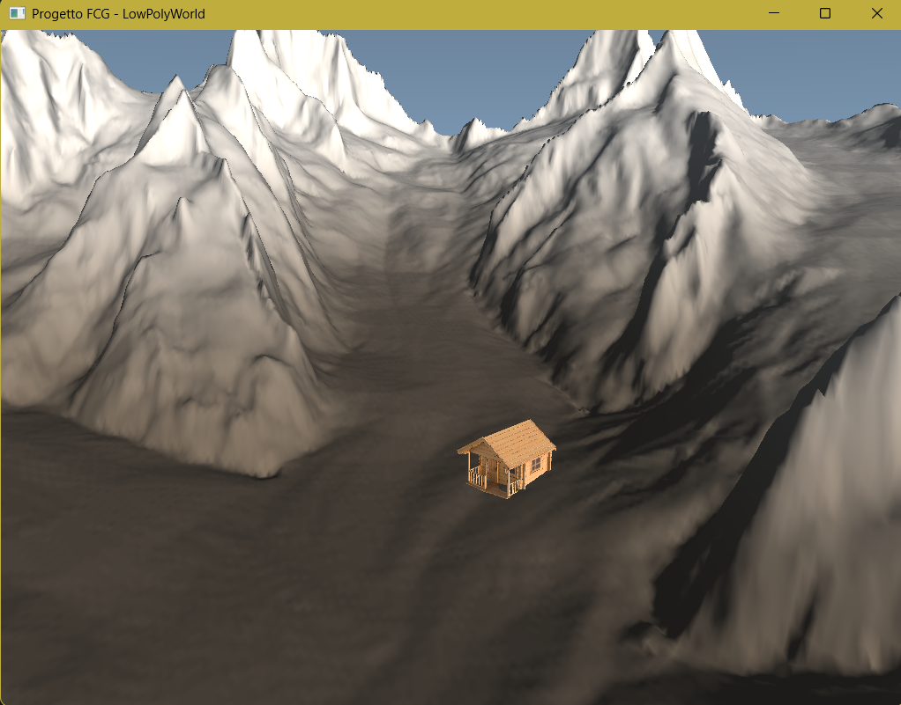

# Tappa 10: Importazione Modelli OBJ, Mappatura Texture e Illuminazione Puntiforme Dinamica

## Istruzioni di Build
Per avviare questa specifica tappa, impostare sia il *Build Target* che il *Launch Target* su `Tappa10` all'interno dell'ambiente CMake. Assicurarsi che i file `bivacco.obj` e `texture.png` siano posizionati correttamente nella cartella `../Cartella-risorse/`.

---

## Obiettivo
L'obiettivo della **Tappa 10** è l'estensione dell'architettura del motore grafico per supportare asset tridimensionali  creati esternamente (tramite software di modellazione come Blender), eliminando i limiti delle geometrie rigide cablate direttamente nel codice. 

Nello specifico, è stato integrato un modello di un bivacco d'alta quota in formato Wavefront `.obj`, completato dalla mappatura di una texture bidimensionale `.png`. L'ambiente è stato reso interattivo introducendo una **Luce Puntiforme (Point Light)** calda che emana dalle finestre della struttura durante la fase notturna del ciclo giorno/notte, completando la resa visiva con una gestione completamente adattiva dello schermo intero.

## Comandi per il Giocatore
I controlli di volo e gestione della simulazione sono stabili e consolidati:
* **Mouse**: Rotazione della telecamera (Imbardata/Yaw e Beccheggio/Pitch).
* **W / S / A / D**: Movimento direzionale nello spazio (Stile Drone).
* **Spazio / Shift Sinistro**: Traslazione verticale assoluta (Su/Giù).
* **TAB**: Sblocco/Blocco del cursore del mouse per l'interazione con il sistema operativo.
* **P**: Attiva/Disattiva la pausa dello scorrere del tempo (Ciclo Giorno/Notte).
* **ESC**: Chiusura immediata dell'applicazione.

---

## Problematiche Affrontate e Soluzioni Ingegneristiche

### 1. Il Collo di Bottiglia dell'I/O sul Disco (CPU Spikes e Rallentamenti)
Nelle prime iterazioni dell'importazione dell'OBJ, la funzione di parsing del file (`loadOBJ`) era stata inclusa all'interno del Game Loop principale. Questo causava la rilettura sequenziale, la decodifica testuale delle stringhe e la riallocazione dei buffer sulla GPU per 60 volte al secondo. Le conseguenze immediate erano vistosi cali di framerate (stuttering) e un carico termico anomalo sulla CPU.

**Soluzione:**
Si è applicato il principio di separazione delle fasi del ciclo di vita del software. Il caricamento del file `.obj` tramite la funzione ottimizzata con `reserve()` e il caricamento della texture tramite `sf::Image` sono stati spostati rigidamente nella **fase di inizializzazione *una tantum***, prima dell'apertura formale della finestra e del loop di rendering. La GPU ora mantiene i dati residenti in memoria nei rispettivi VAO e ID Texture, riducendo l'overhead di CPU a zero durante l'esecuzione.

### 2. Disallineamento dei Sistemi di Coordinate (Modello Sottosopra o Coricato)
I software di modellazione 3D standard (Blender, Maya) esportano spesso i modelli impostando l'asse **Y** come vettore verticale orientato verso l'alto. Il nostro motore grafico, ereditando la convenzione GIS dei dati DEM, utilizza invece l'asse **Z** come coordinata d'altezza. All'importazione grezza, il bivacco si presentava ruotato o capovolto all'interno del terreno.

**Soluzione:**
È stata introdotta una trasformazione algebrica correttiva sulla matrice di modello (`houseModel`). Applicando una rotazione di +90 gradi sull'asse X tramite le librerie GLM, l'asse verticale nativo del modello è stato riallineato con l'asse Z della scena:
```cpp
houseModel = glm::rotate(houseModel, glm::radians(90.0f), glm::vec3(1.0f, 0.0f, 0.0f));
```

### 3. Compenetrazione del Terreno e Disallineamento del Pivot
Molti modelli poligonali online hanno il punto di pivot (l'origine 0,0,0 locale) posizionato al centro geometrico del volume anziché sulla base inferiore del pavimento. Piazzando la casa sulla coordinata del terreno restituita dalla griglia DEM, la metà inferiore della struttura affondava visivamente dentro la montagna.

**Soluzione:**
È stato introdotto un parametro di sfasamento geometrico chiamato `verticalOffset` (impostato sul valore calibrato di `0.005f`). Questo valore viene sommato al vettore di posizione prima del rendering, sollevando la base della struttura e facendola combaciare millimetricamente con la superficie del ghiacciaio. La scala finale del modello è stata rigorosamente standardizzata sul coefficiente moltiplicativo `0.009f`.

### 4. Attenuazione della Luce Puntiforme dalle Finestre
A differenza del sole (luce direzionale), la luce del bivacco deve comportarsi come una sorgente fisica reale: la sua intensità deve decrescere all'aumentare della distanza. Inoltre, la luce non doveva nascere dal pavimento (punto di contatto), ma simulare l'uscita dalle finestre posizionate più in alto.

**Soluzione:**
Nel Fragment Shader del terreno è stata implementata la formula standard dell'attenuazione quadratica:
Attenuation = 1.0 / (Kc + Kl * d + Kq * d^2)

I coefficienti sono stati tarati per lo spazio normalizzato NDC (Kc=1.0, Kl=25.0, Kq=180.0). Per far emanare il flusso luminoso dalle finestre, la posizione passata allo shader (`windowLightPos`) è stata calcolata aggiungendo un ulteriore offset rispetto alla base rialzata della casa:
```cpp
glm::vec3 windowLightPos = housePos + glm::vec3(0.0f, 0.0f, verticalOffset + 0.004f);
```

### 5. Il Canvas Bloccato in Basso a Sinistra al Cambio Risoluzione
Abilitando lo schermo intero o massimizzando la finestra, OpenGL continuava a renderizzare la scena all'interno del vecchio rettangolo statico da 1024x768 pixel nell'angolo inferiore sinistro del monitor, lasciando il resto dello schermo nero. Questo accade perché il *Viewport* della GPU non si aggiorna automaticamente con i pixel fisici allocati dal sistema operativo.

**Soluzione:**
È stata rimossa la gestione asincrona dell'evento di resize (spesso soggetta a latenze o mancati trigger del sistema operativo) e si è optato per un approccio deterministico. All'inizio di ogni singolo frame, le dimensioni fisiche attuali della finestra vengono interrogate tramite `window.getSize()`. Il Viewport di OpenGL e la matrice di proiezione prospettica vengono forzati a riadattarsi istantaneamente, ricalcolando l'Aspect Ratio corretto:
```cpp
sf::Vector2u currentSize = window.getSize();
glViewport(0, 0, currentSize.x, currentSize.y);
float aspectRatio = static_cast<float>(currentSize.x) / static_cast<float>(currentSize.y);
glm::mat4 projection = glm::perspective(glm::radians(45.0f), aspectRatio, 0.1f, 100.0f);
```

---

## Struttura Architetturale della Tappa 10
Il flusso dati della pipeline grafica è ora così ripartito:

```text
[Inizializzazione] -> Caricamento DEM (Terreno)
                   -> Parsing OBJ (Bivacco) -> Memoria GPU ( houseVAO )
                   -> Caricamento PNG (Texture) -> ID Texture OpenGL
                          │
                          ▼
[Game Loop]        -> Rilevamento Real-Time Risoluzione Finestra
                   -> Aggiornamento GlViewport e Matrice di Proiezione (No Stretch)
                   -> Calcolo Posizione Sole e Attivazione Luce Bivacco (Se Notte)
                   -> Rendering Skybox Procedurale (Sole, Stelle, Sfumature)
                   -> Rendering Terreno (Phong + Ombreggiatura Giorno + Alone Point Light)
                   -> Rendering Bivacco OBJ (Mappatura coordinate UV + Texture attiva)
```
## Screenshot



