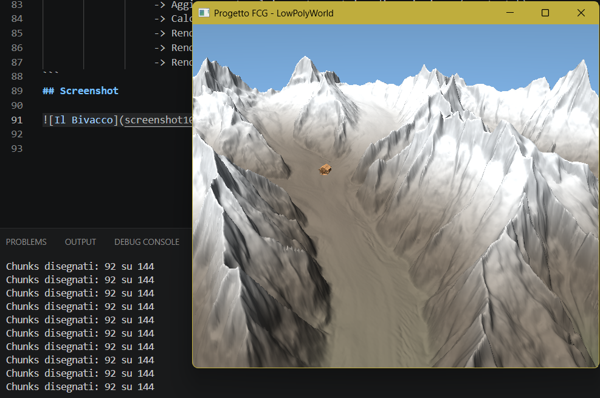

# Tappa 11: Suddivisione in Chunk e Frustum Culling (Ottimizzazione Estrema)

## Istruzioni di Build
Per avviare questa specifica tappa, impostare sia il *Build Target* che il *Launch Target* su `Tappa11` all'interno dell'ambiente CMake. Assicurarsi che i file di risorsa (`bivacco.obj` e `texture.png`) siano presenti nella cartella globale delle risorse `../Cartella-risorse/`.

---

## Obiettivo
L'obiettivo della **Tappa 11** è stato l'abbattimento radicale del carico computazionale sulla GPU tramite l'implementazione del **Frustum Culling** geometrico assistito da un'architettura a **Chunk** (tassellazione del terreno). 

Fino alla tappa precedente, l'intero ghiacciaio DEM veniva inviato alla pipeline grafica come un unico blocco monolitico, costringendo la scheda video a calcolare trasformazioni e illuminazione anche per milioni di poligoni situati alle spalle della telecamera o fuori dal campo visivo. Questa tappa introduce la scomposizione del mondo in sottomatrici indipendenti e lo scarto preventivo a livello CPU degli elementi non visibili.

## Comandi per il Giocatore
I controlli di navigazione tridimensionale rimangono invariati:
* **Mouse**: Orientamento dello sguardo (Imbardata/Yaw e Beccheggio/Pitch).
* **W / S / A / D**: Movimento direzionale nello spazio tridimensionale.
* **Spazio / Shift Sinistro**: Movimento verticale assoluto lungo l'asse Z (Su/Giù).
* **TAB**: Sblocco/Blocco del cursore del mouse per l'interazione con l'OS.
* **P**: Attiva/Disattiva la pausa del ciclo temporale giorno/notte.
* **ESC**: Chiusura immediata dell'applicazione.

---

## Problematiche Affrontate e Soluzioni Ingegneristiche

### 1. Il Vincolo del Monolito: Impossibilità di Scarto Parziale
Inviare il terreno tramite un solo Vertex Array Object (VAO) impedisce ad OpenGL di effettuare ottimizzazioni granulari: o si disegna tutto il ghiacciaio o non si disegna nulla. Per preparare il motore ad accogliere una risoluzione geografica chilometrica senza saturare la GPU, era necessario spezzare la griglia.

**Soluzione (Chunking):**
Il parser dei dati DEM è stato riprogettato per suddividere la griglia bidimensionale `rows x cols` in sotto-quadrati locali indipendenti di dimensione fissa ($64 \times 64$ vertici), chiamati **Chunk**. Ogni Chunk alloca sulla memoria video i propri buffer VBO ed EBO dedicati e calcola autonomamente il proprio numero di indici per il disegno (`indexCount`).

### 2. Calcolo dei Limiti Spaziali (Bounding Box AABB)
Per poter decidere se un chunk è visibile o meno, la CPU deve conoscere l'ingombro spaziale minimo e massimo di quella porzione di montagna, evitando però di ciclare tutti i singoli vertici a ogni frame (operazione che vanificherebbe il guadagno prestazionale).

**Soluzione:**
Durante la fase di inizializzazione e generazione del chunk, viene calcolato il **Bounding Box Allineato agli Assi (AABB)**. Ciclando i vertici una sola volta all'avvio, si estraggono i due vettori estrremi: `minP` (punto più basso e arretrato) e `maxP` (punto più alto e avanzato). Questa scatola invisibile racchiude perfettamente la porzione di rilievo alpino del chunk.

### 3. Estrazione dei Piani della Piramide Visiva (Frustum)
Il campo visivo dell'osservatore non è infinito, ma è delimitato da una piramide troncata (Frustum) definita dalle impostazioni della telecamera e dalle matrici di proiezione. Bisognava estrarre matematicamente le equazioni dei 6 piani che delimitano questo spazio a ogni spostamento del giocatore.

**Soluzione:**
È stata implementata la funzione `extractFrustum`, che estrae i coefficienti dei 6 piani visivi (Sinistro, Destro, Inferiore, Superiore, Vicino, Lontano) direttamente combinando le componenti algebriche della matrice combinata **View-Projection (VP)**. I vettori normali di ciascun piano vengono estratti e normalizzati matematicamente per consentire il calcolo delle distanze punto-piano.

### 4. Algoritmo di Intersezione AABB-Frustum (Culling)
Una volta ottenuti i 6 piani del Frustum e le scatole AABB di ogni chunk, era necessario un test geometrico ultra-rapido da eseguire nel Game Loop prima di invocare i comandi di disegno.

**Soluzione:**
Prima di eseguire il `glDrawElements` di una piastrella di terreno, la CPU esegue la funzione predittiva `isAABBVisible`. Il test calcola il "punto più vicino" dell'AABB rispetto alla direzione della normale di ciascun piano. Se per anche solo uno dei 6 piani questo punto si trova nella porzione esterna (distanza negativa), il chunk viene bollato come invisibile e scartato istantaneamente. Il comando di draw viene saltato, risparmiando alla GPU il calcolo di migliaia di triangoli.

### 5. Strumentazione e Debug delle Prestazioni
Per validare l'efficacia dell'algoritmo di culling, era necessario quantificare visivamente lo scarto computazionale in tempo reale.

**Soluzione:**
È stato introdotto un contatore incrementale `chunksDrawn` accoppiato a un timer asincrono gestito tramite `sf::Clock`. Ogni secondo (1.0s), il motore stampa sul terminale di debug il numero esatto di chunk inviati a schermo rispetto al totale complessivo. Orientando la telecamera verso i costoni rocciosi isolati o verso lo spazio vuoto, il counter mostra una riduzione drastica dei chunk attivi (es. 12 su 48), certificando il successo dell'ottimizzazione in tempo reale.

---

## Struttura della Pipeline Grafica Ottimizzata (Tappa 11)

[Inizializzazione] 
  └── Lettura DEM -> Suddivisione in Griglie 64x64 -> Calcolo Normali e AABB
  └── Generazione Array di Strutture 'Chunk' -> Allocazione N VAO/VBO/EBO induriti
  └── Caricamento Singolo Bivacco.obj + Binding Texture.png

[Game Loop Principale]
  ├── Interrogazione Dimensioni Finestra -> Aggiornamento Dinamico GlViewport e Proiezione
  ├── Aggiornamento Matrice Vista (Telecamera) -> Calcolo Matrice Combinata View-Projection
  ├── Estrazione dei 6 Piani del Frustum Corrente (extractFrustum)
  │
  ├── [Fase Culling Terreno]
  │     └── FOR EACH Chunk in TerrainChunks:
  │           └── Test isAABBVisible(Chunk.AABB, Frustum)
  │                 ├── TRUE  -> Bind VAO -> glDrawElements (Renderizzato) -> chunksDrawn++
  │                 └── FALSE -> Salta il blocco (Scartato dalla CPU)
  │
  ├── [Stampa Diagnostica] -> Se Timer >= 1.0s -> std::cout << chunksDrawn / Totale
  └── Rendering Bivacco.obj (In piedi, texturizzato con offset Z = 0.005f)

## Screenshot

