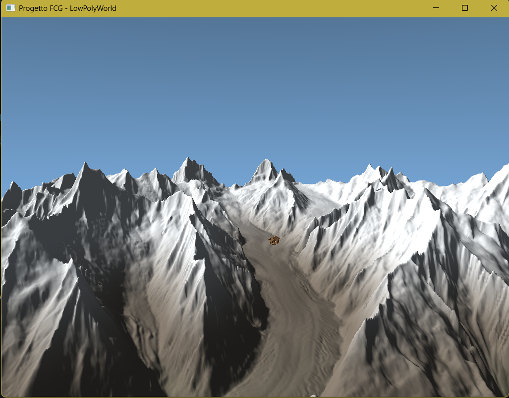

# Tappa 12: Espansione Chilometrica, Ricalibrazione Morfologica e Ground Clamping Fisico

## Istruzioni di Build
Per avviare questa specifica tappa, impostare sia il *Build Target* che il *Launch Target* su `Tappa12` all'interno dell'ambiente CMake. Assicurarsi che i file di risorsa (`bivacco.obj` e `texture.png`) siano presenti nella cartella globale delle risorse `../Cartella-risorse/`.

---

## Obiettivo
L'obiettivo della **Tappa 12** è l'abbandono definitivo delle geometrie in scala ridotta per abbracciare un ambiente esplorabile di proporzioni chilometriche (1 km²), implementando contemporaneamente un sistema di collisione con il terreno (*Ground Clamping*) leggero, deterministico e ad alte prestazioni. 

Il passaggio alla scala reale ha richiesto una profonda ristrutturazione delle proporzioni matematiche del mondo: dall'escursione verticale delle creste montuose alla velocità di navigazione della telecamera, fino alla propagazione dei fotoni nello shader. Il risultato sposta l'applicazione da un semplice visualizzatore di un "plastico" a un vero e proprio motore di simulazione in prima persona ad altezza d'uomo.

## Comandi per il Giocatore
* **Mouse**: Orientamento dinamico dello sguardo (Imbardata/Yaw e Beccheggio/Pitch).
* **W / S / A / D**: Movimento direzionale nello spazio tridimensionale.
* **Spazio / Shift Sinistro**: Movimento verticale assoluto lungo l'asse Z. *(Nota: il limite inferiore è ora vincolato rigidamente dalla fisica del terreno).*
* **TAB**: Sblocco/Blocco del cursore del mouse per l'interazione con l'OS.
* **P**: Attiva/Disattiva la pausa del ciclo solare giorno/notte.
* **ESC**: Chiusura immediata dell'applicazione.

---

## Problematiche Affrontate e Soluzioni Ingegneristiche

### 1. Il Mondo Troppo Piccolo 
Nelle versioni precedenti, il ghiacciaio DEM era confinato in uno spazio normalizzato microscopico. Anche applicando una timida scala iniziale (100x), il raggio d'azione era minimo.

**Soluzione:**
La scala globale del mondo (`mapScale`) è stata elevata a 1000.0f, espandendo X e Y per coprire un chilometro quadrato effettivo. Per consentire la visibilità dell'orizzonte senza clipping della geometria, il piano di ritaglio lontano della matrice di proiezione prospettica (`Far Plane`) è stato spinto a 1500.0f. La velocità della telecamera (`cameraSpeed`) è stata calibrata sul valore ottimale di 50.0f unità al secondo per consentire un'esplorazione dinamica ma realistica delle distanze chilometriche.

### 2. La Compenetrazione Geometrica con il Terreno
Senza un sistema di vincoli fisici, la telecamera si comportava come uno spettro, volando attraverso i costoni di roccia e sprofondando sotto di essi non appena si guardava verso il basso.

**Soluzione (Ground Clamping):**
È stata implementata una funzione matematica di Interpolazione Bilineare (`getTerrainHeight`) eseguita in tempo reale dalla CPU all'interno del Game Loop. L'algoritmo interroga la posizione assoluta (X, Y) della telecamera, individua il singolo quadrante di triangoli della griglia DEM in cui si trova l'utente, e ne calcola l'altezza Z sub-poligonale esatta interpolando i 4 vertici circostanti. 

La telecamera viene bloccata matematicamente aggiungendo l'altezza simulata degli occhi del giocatore (1.78f metri):

float terrainZ = getTerrainHeight(cameraPos.x, cameraPos.y);
if (cameraPos.z < terrainZ + 1.78f) {
    cameraPos.z = terrainZ + 1.78f;
}

Se l'utente tenta di sprofondare premendo 'W' verso il basso, la telecamera scivola fluidamente lungo il profilo del pendio, simulando una camminata reale sul ghiacciaio.

### 3. Le Montagne Appiattite e il Bivacco Compenetrato
L'espansione planare a 1000x ha introdotto un grave effetto collaterale morfologico: i poligoni si sono "spalmati" su un'area immensa, appiattendo completamente i rilievi e trasformando le cime alpine in colline. Contemporaneamente, scalando il bivacco a 9.0f (proporzionato al mondo), la struttura è letteralmente sprofondata sotto la neve; questo accade perché il pivot dell'OBJ è al centro del modello e l'espansione geometrica ha spinto la metà inferiore del bivacco in profondità dentro la montagna.

**Soluzione:**
* Morfologia: Il coefficiente moltiplicativo dell'asse Z è stato calibrato sul valore di 0.4f. Questa correzione restituisce verticalità al ghiacciaio, ricreando pareti rocciose imponenti, creste aguzze e valli profonde, eliminando l'aspetto piatto.
* Quota Neve: Di conseguenza, la snowline all'interno del Fragment Shader del terreno è stata elevata a quota 200.0, evitando che la neve perenne invadesse il fondovalle.
* Bivacco ed Offset: La casa è stata stabilizzata impostando un `verticalOffset = 8.0f` per tirare il pavimento fuori dalla compenetrazione nevosa. Anche la sorgente di luce notturna delle finestre è stata calibrata di conseguenza per inseguire il rialzo:

float verticalOffset = 8.0f;
glm::vec3 wLightPos = housePos + glm::vec3(0, 0, verticalOffset + 8.0f);

---

## Struttura e Flusso Dati (Tappa 12)

[Fase Inizializzazione] -> Caricamento DEM -> Moltiplicazione Griglia (X,Y * 1000.0f, Z * 0.4f)
                        -> Generazione Chunk 64x64 con Bounding Box AABB aggiornati
                        -> Caricamento Bivacco.obj (Scala fissa = 9.0f)
                              │
                              ▼
[Game Loop Principale]  -> Calcolo DeltaTime e Input (CameraSpeed = 50.0f)
                        -> Query getTerrainHeight(Cam.X, Cam.Y) -> Interpolazione Bilineare
                        -> Ground Clamping: Vincolo rigido Cam.Z >= terrainZ + 1.78m
                        -> Calcolo Matrice View-Projection con Far Plane = 1500.0f
                        -> Estrazione Frustum ed esecuzione Culling dei Chunk fuori campo
                        -> Rendering Terreno (Quota neve = 200.0, Attenuazione Point Light estesa)
                        -> Rendering Bivacco.obj (Ancorato al suolo con verticalOffset = 8.0f)

## Screenshot

