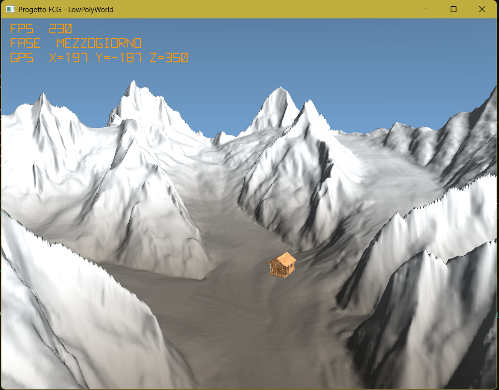

# Tappa 13: Interfaccia Utente (HUD) e Telemetria Dinamica in Tempo Reale

## Istruzioni di Build
Per avviare questa specifica tappa, impostare sia il *Build Target* che il *Launch Target* su `Tappa13` all'interno dell'ambiente CMake. Assicurarsi che i file di risorsa (`bivacco.obj` e `texture.png`) siano presenti nella cartella globale delle risorse `../Cartella-risorse/`.

---

## Obiettivo
L'obiettivo della **Tappa 13** è l'introduzione di un sistema di telemetria e visualizzazione dati in tempo reale direttamente sovrimpresso sullo schermo (**HUD - Head-Up Display**). 

Per evitare dipendenze da librerie esterne o il caricamento di file di font pesanti e non portabili (come i file .ttf), l'architettura è stata estesa introducendo una pipeline di **rendering vettoriale dinamico**. Disattivando temporaneamente il test di profondità ed eseguendo uno switch controllato tra la proiezione prospettica 3D e una **proiezione ortografica 2D in pixel**, il motore è ora in grado di disegnare stringhe alfanumericamente complesse (FPS, coordinate GPS e fase del ciclo solare) mantenendo le prestazioni vicine allo zero overhead.

## Comandi per il Giocatore
I controlli di volo e interazione con l'ambiente sono stabili:
* **Mouse**: Orientamento dello sguardo (Yaw e Pitch).
* **W / S / A / D**: Movimento direzionale (velocità fissata a 50.0f unità/secondo).
* **Spazio / Shift Sinistro**: Traslazione verticale (coordinata Z vincolata dal terreno).
* **TAB**: Blocco/Sblocco del cursore del mouse.
* **P**: Pausa del ciclo giorno/notte.
* **ESC**: Chiusura dell'applicazione.

---

## Problematiche Affrontate e Soluzioni Ingegneristiche

### 1. Il Crash di Cleanup dei Buffer Orfani
Durante la transizione dall'architettura a griglia singola a quella suddivisa in **Chunk** (Tappa 11 e 12), il codice di rilascio delle risorse a fine esecuzione chiamava ciecamente `glDeleteVertexArrays(1, &VAO)` su puntatori globali ormai rimossi. Questo causava un errore bloccante del compilatore o un crash silente del driver grafico alla chiusura del programma (Memory Leak video).

**Soluzione:**
È stata eliminata la vecchia riga di rimozione statica e sostituita con un ciclo iterativo deterministico che scorre il vettore dei chunk attivi, liberando la memoria video in modo speculare a come era stata allocata:

for (auto& chunk : terrainChunks) {
    glDeleteVertexArrays(1, &chunk.VAO);
    glDeleteBuffers(1, &chunk.VBO);
    glDeleteBuffers(1, &chunk.EBO);
}

### 2. Il Jittering del Contatore FPS (Overflow Matematico)
Calcolare il framerate dividendo semplicemente l'unità per il DeltaTime (`1.0f / deltaTime`) a ogni singolo frame produceva due anomalie: a framerate molto alti il valore tendeva all'infinito mandando in overflow il testo, e lo sfarfallio continuo rendeva i numeri totalmente illeggibili a schermo.

**Soluzione:**
È stato implementato un **accumulatore temporale** con una finestra di campionamento di 0.5 secondi. La CPU conta il numero di frame effettivi che transitano nel buffer temporale e aggiorna la stringa dell'HUD solo allo scadere del timer, stabilizzando la telemetria:

fpsTimer += deltaTime;
frameCount++;
if (fpsTimer >= 0.5f) {
    displayFPS = (int)(frameCount / fpsTimer);
    frameCount = 0;
    fpsTimer = 0.0f;
}

### 3. Posizione spawn  e l'Estetica dell'HUD
Nascere troppo vicini al suolo toglieva il senso di scala chilometrica del ghiacciaio (Z-Scale a 0.4f e quota neve a 200.0). Inoltre, il primo prototipo di HUD con font verde neon stile fosfori anni '90 creava un contrasto cromatico sgradevole e poco professionale con l'ambiente naturale circostante.

**Soluzione:**
* **Spawn:** La coordinata Z iniziale in `cameraPos` è stata elevata a **400.0f**, consentendo un inserimento in quota da "volo d'aquila" per apprezzare l'orizzonte geometrico profondo (Far Plane a 1500.0f).
* **Cromia:** Il colore dei vettori dell'HUD è stato modificato impostando una tonalità **Ambra** (`glm::vec3(1.0f, 0.6f, 0.0f)`), che richiama la strumentazione dei cockpit reali e dei droni professionali, garantendo massima leggibilità sia sulla neve che durante la notte.
* **Rimozione Mirino:** È stata rimossa qualsiasi traccia di mirino centrale per mantenere la visuale pulita e focalizzata sul paesaggio.

### 4. Mappatura Semantica del Ciclo Giorno/Notte
Mostrare solo l'angolo numerico del sole non era intuitivo per l'utente. C'era bisogno di tradurre la rotazione algebrica della luce direzionale in concetti testuali comprensibili.

**Soluzione:**
È stata inserita una logica di controllo nel loop che analizza il progresso del sole (normalizzato tra 0 e Pi Greco) e mappa i quadranti solari in 5 stati testuali dinamici passati all'HUD: **MATTINA**, **MEZZOGIORNO**, **POMERIGGIO**, **SERA** e **NOTTE**.

---

## Struttura della Pipeline e Gestione dei Livelli (Tappa 13)

[Game Loop Principale]
  ├── [Fase 3D - Proiezione Prospettica]
  │     ├── Abilita GL_DEPTH_TEST
  │     ├── Rendering Skybox Procedurale (Sole, Stelle, Sfumature)
  │     ├── Culling ed esecuzione Chunk del Terreno (Scala Z=0.4f, Neve=200.0)
  │     └── Rendering Bivacco.obj (Scala=9.0f, Offset=8.0f)
  │
  └── [Fase 2D - Proiezione Ortografica (HUD Overlay)]
        ├── Disabilita GL_DEPTH_TEST (Il testo sovrascrive tutto)
        ├── Caricamento Shader HUD dedicato (Trasformazione in coordinate pixel)
        ├── Calcolo e formattazione stringhe (FPS accumulati, Fase Solare, GPS X/Y/Z)
        ├── Generazione dinamica linee tramite Stroke Font Vettoriale
        ├── Upload dei dati nel VBO dinamico tramite GL_DYNAMIC_DRAW
        └── glDrawArrays(GL_LINES) con Colore Ambra Aeronautico

## Screenshot Progetto

