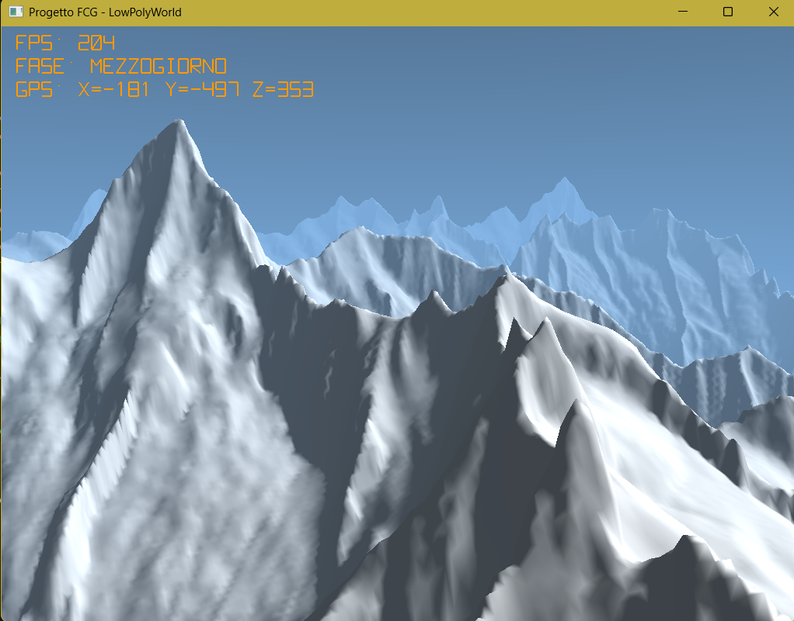

# Tappa 14: Nebbia di Profondità Esponenziale e Collisioni Solide del Bivacco

## Istruzioni di Build
Per avviare questa specifica tappa, impostare sia il *Build Target* che il *Launch Target* su `Tappa14` all'interno dell'ambiente CMake. Assicurarsi che i file di risorsa (`bivacco.obj` e `texture.png`) siano presenti nella cartella globale delle risorse `../Cartella-risorse/`.

---

## Obiettivo
L'obiettivo della **Tappa 14** è il completamento della pipeline grafica e del sistema di navigazione attraverso l'introduzione della **Nebbia Atmosferica Esponenziale (Depth Fog)** per un realismo visivo profondo, accoppiato a un motore di **collisioni solide tridimensionali** per l'asset del bivacco.

Fino alla tappa precedente, l'orizzonte soffriva di un taglio geometrico netto in corrispondenza del *Far Plane* (fissato a 1500 unità), svelando la natura artificiale della simulazione. Inoltre, la telecamera si comportava come un fantasma in grado di trapassare le pareti e le finestre della struttura poligonale del bivacco.

## Comandi per il Giocatore
I controlli di navigazione sono gli stessi:
* **Mouse**: Orientamento dinamico dello sguardo (Imbardata/Yaw e Beccheggio/Pitch).
* **W / S / A / D**: Movimento direzionale nello spazio (Velocità fissa a 50.0f unità/secondo).
* **Spazio / Shift Sinistro**: Movimento verticale lungo l'asse Z. *(Vincolato sia dal suolo che dalla struttura del bivacco).*
* **TAB**: Sblocco/Blocco del cursore del mouse per l'interazione con l'OS.
* **P**: Attiva/Diminuisce la pausa dello scorrere del tempo (Ciclo Giorno/Notte).
* **ESC**: Chiusura immediata dell'applicazione.

---

## Problematiche Affrontate e Soluzioni Ingegneristiche

### 1. Il Taglio Netto dell'Orizzonte 
Con l'espansione della mappa a un chilometro quadrato, la vista prospettica si interrompeva bruscamente a 1500 unità di distanza.

**Soluzione (Depth Fog Esponenziale):**
È stata implementata un'equazione di nebbia atmosferica esponenziale quadratica all'interno dei Fragment Shader del terreno e del modello OBJ. Lo shader calcola la distanza euclidea esatta tra la telecamera (`viewPos`) e il frammento renderizzato (`FragPos`). Tramite un fattore di densità calibrato (0.0018), il colore nativo del pixel viene miscelato progressivamente con il colore dinamico dell'orizzonte attuale (`fogColor`), facendo sfumare i rilievi montuosi remoti nella foschia del cielo:

float fogDist = length(viewPos - FragPos);
float fogFactor = exp(-pow(fogDist * fogDensity, 2.0));
FragColor = mix(vec4(fogColor, 1.0), vec4(finalTerrainColor, 1.0), clamp(fogFactor, 0.0, 1.0));


### 2. La Telecamera Spettrale e la Compenetrazione del Bivacco
Sebbene il motore includesse un ottimo sistema di *Ground Clamping* per non sprofondare nella neve, la telecamera non risentiva della presenza dei muri del bivacco. L'utente poteva volare liberamente attraverso le pareti in legno e le finestre della struttura, annullando il realismo spaziale dell'asset geometrico.

**Soluzione (Volume Solido AABB con Push-Back):**
È stata introdotto un volume di collisione invisibile di tipo **AABB (Axis-Aligned Bounding Box)** calcolato nello spazio globale attorno alla posizione della casa. Quando l'utente si muove, la CPU controlla se la posizione della telecamera interseca la scatola geometrica del bivacco (estesa lateralmente con un raggio di tolleranza di 2 unità per simulare la massa fisica del giocatore). 

In caso di sovrapposizione, l'algoritmo calcola quale dei 4 muri perimetrali è geometricamente più vicino e applica istantaneamente una forza di spinta contraria (**Push-Back**) sulla telecamera, riposizionandola al di fuori del perimetro solido e permettendole di scivolare fluidamente lungo le pareti senza trapassarle.

### 3. Il Difetto della "Fisica Selettiva" e il Disallineamento della Z
Nel primo prototipo del sistema di collisione, la base inferiore della scatola AABB era stata agganciata allo stesso offset visivo del pavimento del bivacco (+8.0f). Poiché il *Ground Clamping* mantiene gli occhi del giocatore a un'altezza di 1.78f metri dal suolo, l'utente camminando si trovava matematicamente al di sotto del limite minimo della scatola d'impatto. Di conseguenza, il muro respingeva il giocatore solo se questi volava verso il tetto (sopra gli 8 metri), mentre lo faceva passare da sotto all'altezza delle finestre del primo piano.

**Soluzione:**
La geometria della scatola di collisione invisibile è stata ristrutturata estendendo asimmetricamente l'asse verticale Z. Le fondamenta della scatola sono state spinte in profondità sotto il manto nevoso (-5.0f) e il tetto della barriera è stato elevato ben oltre la cresta geometrica della casa (35.0f), creando una colonna di sbarramento solida impenetrabile a qualsiasi quota di volo o camminata:

houseCollisionAABB.minP = housePos + glm::vec3(-10.0f, -10.0f, -5.0f);
houseCollisionAABB.maxP = housePos + glm::vec3( 10.0f,  10.0f,  25.0f);


---

## Parametri Ingegneristici Validati e Consolidati
Il motore grafico chiude lo sviluppo stabilizzando i seguenti parametri personalizzati:
* **Scala Planare:** 1000.0f (Mappa espansa a 1 km²).
* **Morfologia Verticale:** 0.4f (Rilievi alpini aguzzi, imponenti e realistici).
* **Quota Neve Permanente:** 200.0f (Snowline confinata in alta quota nel Fragment Shader).
* **Velocità Navigazione:** 50.0f unità/secondo (Controllabilità perfetta degli spazi).
* **Spawn Iniziale:** Quota Z impostata a 400.0f (Inserimento visivo panoramico dall'alto).
* **Offset Bivacco:** 8.0f per la struttura poligonale; `verticalOffset + 8.0f` per l'emanazione del flusso di luce puntiforme dalle finestre.

---

## Flusso della Pipeline Grafica

```text
[Game Loop Principale]
  ├── [Fase 1: Input e Calcolo Spostamenti] -> Aggiornamento coordinate teoriche Cam.X, Cam.Y
  │
  ├── [Fase 2: Motore Fisico - Risoluzione Collisioni Bivacco]
  │     └── IF (cameraPos dentro houseCollisionAABB)
  │           └── Identifica il muro perimetrale più vicino
  │           └── Applica Push-Back laterale immediato (Cam.X/Y rispinti all'esterno)
  │
  ├── [Fase 3: Motore Fisico - Ground Clamping]
  │     └── Calcolo getTerrainHeight(Cam.X, Cam.Y) tramite Interpolazione Bilineare
  │     └── Forza vincolo Cam.Z >= terrainZ + 1.78m (Altezza occhi stabile)
  │
  ├── [Fase 4: Pipeline Rendering 3D (Prospettica)]
  │     ├── Attivazione GL_DEPTH_TEST
  │     ├── Render Skybox Procedurale -> Estrazione colore orizzonte dinamico (curH)
  │     ├── Estrazione piani Frustum -> Culling preventivo dei Chunk DEM
  │     ├── Render Terreno -> Iniezione viewPos e fogColor(curH) -> Sfumatura Esponenziale
  │     └── Render Bivacco.obj -> Iniezione viewPos e fogColor(curH) -> Sfumatura Coerente
  │
  └── [Fase 5: Pipeline Rendering 2D (Ortografica)]
        ├── Disattivazione GL_DEPTH_TEST
        └── Render HUD Vettoriale -> Output FPS (accumulati), Fase Giorno, GPS (X,Y,Z) in Ambra
```

## Screenshot Progetto

