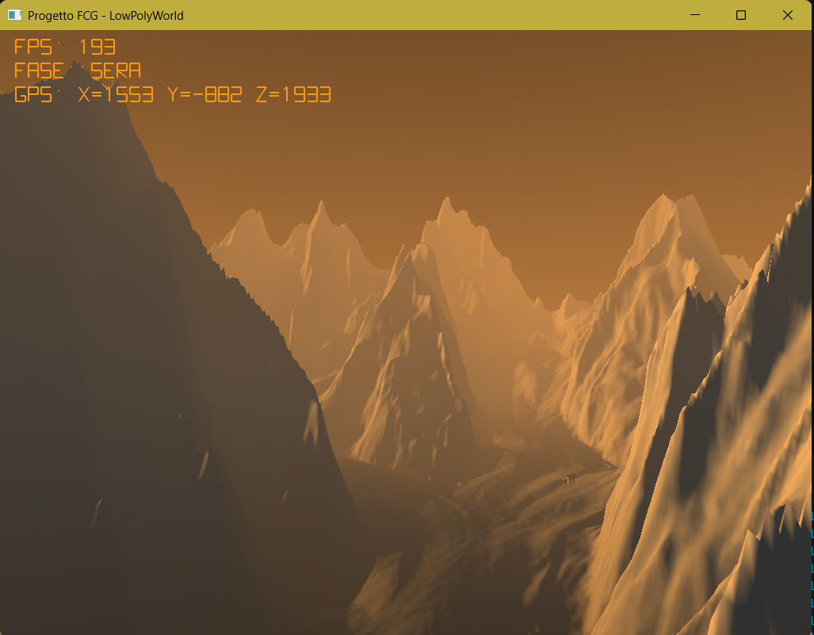

# Tappa 15: Simulazione su Grande Scala (5km²) e Calibrazione Atmosferica

## Istruzioni di Build
Per avviare questa specifica tappa, impostare sia il *Build Target* che il *Launch Target* su `Tappa15` all'interno dell'ambiente CMake. Assicurarsi che i file di risorsa (`bivacco.obj` e `texture.png`) siano presenti nella cartella globale delle risorse `../Cartella-risorse/`.

---

## Obiettivo
L'obiettivo della **Tappa 15** è spingere l'architettura del motore grafico per testare la stabilità matematica e l'impatto visivo di una mappa su grossa scala territoriale  (**5 chilometri quadrati**). 

La dilatazione dello spazio a 5000 unità planari ha rotto l'equilibrio di quasi tutti i parametri consolidati nelle tappe precedenti. Lo sviluppo si è quindi concentrato su una complessa operazione di ricalibrazione: dal coefficiente di rugosità morfologica alla propagazione della luce notturna su lunghe distanze, fino alla rarefazione controllata della nebbia atmosferica per sbloccare panorami ad ampio respiro privi di artefatti visivi.

## Comandi per il Giocatore
I comandi sono i medesimi:
* **Mouse**: Orientamento dello sguardo (Yaw/Pitch).
* **W / S / A / D**: Navigazione direzionale tridimensionale. *(Velocità impostata a 300.0f unità/secondo per navigazione ad alta quota).*
* **Spazio / Shift Sinistro**: Movimento verticale lungo l'asse Z (vincolato dal terreno e dai muri).
* **TAB**: Sblocco/Blocco del cursore del mouse.
* **P**: Attiva/Disattiva lo scorrimento del tempo solare.
* **ESC**: Chiusura immediata dell'applicazione.

---

## Problematiche Affrontate e Soluzioni Ingegneristiche

### 1. L'Appiattimento Morfologico e la Deformazione Climatica
Espandendo la mappa a 5000 unità senza variare l'asse Z, i poligoni del ghiacciaio si sono stirati a dismisura, trasformando costoni di roccia aguzzi in pianure collinari sbiadite. Inoltre, la quota neve originale ha sommerso l'intera valle, poiché le cime reali toccavano vette altimetriche sproporzionate rispetto alla scala orizzontale.

**Soluzione:**
Il moltiplicatore Z delle `gridPositions` è stato aumentato e impostato a **0.5f**. Per preservare l'equilibrio cromatico della vegetazione e della roccia grigia , i limiti di transizione delle funzioni `smoothstep` nel Fragment Shader del terreno sono stati moltiplicati, stabilizzando la neve sopra i 2000 metri virtuali di quota:

    vec3 tC = (FragPos.z < 1250.0) ? mix(cV, cR, smoothstep(-50.0, 1250.0, FragPos.z)) : mix(cR, cS, smoothstep(1250.0, 2000.0, FragPos.z));


### 2. Allineamento della Nebbia Atmosferica (Il Bug del "Bivacco In Ombra")
Configurando la nebbia su una visuale profonda (Far Plane esteso a 8000 unità), un valore di densità standard azzerava la visibilità. Diradando la nebbia solo nel terreno, si è verificato un disallineamento ottico: quando la telecamera si allontanava, il bivacco appariva come una sagoma scura o un buco nero innaturale sullo sfondo della neve limpida. Questo accadeva perché la densità della nebbia differiva tra lo shader del terreno e quello dell'OBJ.

**Soluzione:**
È stata stabilita una densità della nebbia perfettamente simmetrica su entrambi i Fragment Shader, impostando `fogDensity = 0.00035`. Questo valore garantisce un'atmosfera tersa da alta montagna, permettendo di scorgere l'orizzonte profondo e facendo fondere sia la montagna che la casa in modo omogeneo nel cielo man mano che ci si allontana.

### 3. Il Bivacco e la Nuova Formula di Attenuazione
Con un'estensione di 5km, la sorgente luminosa notturna del bivacco (calcolata con i vecchi parametri) svaniva a pochissimi metri di distanza a causa della rigida attenuazione quadratica dei fotoni. Da lontano, la casa sembrava una lucciola spenta nel buio della vallata.

**Soluzione:**
La pipeline di illuminazione del bivacco è stata potenziata su tre fronti coordinati:
* **Dimensione:** Il modello è stato scalato per mantenere una visibilità ottimale nello spazio immenso senza sprofondare nel terreno.
* **Potenza Luce:** Il moltiplicatore di intensità (`bivColor`) è stato aumentato per generare un flusso energetico arancione marcato.
* **Equazione di Attenuazione:** I coefficienti lineare e quadratico nel Fragment Shader del terreno sono stati drasticamente ridotti per consentire alla luce di viaggiare su maggiori distanze prima di spegnersi:

float att = 1.0 / (1.0 + 0.002 * distToLight + 0.0005 * (distToLight * distToLight)); vec3 ptRes = pointLightColor * diffPt * att;

La lampadina fisica (`wLightPos`) è stata sollevata a quota `verticalOffset + 30.0f` per centrarsi perfettamente sotto il soffitto rialzato del modello ingrandito.

### 4. Ristrutturazione della Fisica Tridimensionale
L'allargamento del bivacco a scala 25.0f ha reso la vecchia scatola di collisione AABB totalmente inutile, poiché copriva solo il centro della stanza, permettendo alla telecamera di trapassare i muri perimetrali esterni.

**Soluzione:**
L'impronta a terra della scatola di collisione tridimensionale è stata ampliata a un raggio di +/-25 unità e il tetto è stato riproporzionato a quota 30.0f. La quota inferiore è ancorata a -10.0f sotto lo zero per evitare che il *Ground Clamping* (che agisce ad altezza occhi 1.78f) bypassasse i controlli fisici a livello di fondovalle:

    houseCollisionAABB.minP = housePos + glm::vec3(-15.0f, -15.0f, -10.0f);
    houseCollisionAABB.maxP = housePos + glm::vec3( 15.0f,  15.0f,  30.0f);

### 5. Ottimizzazione Computazionale (VSync) e Interfaccia Telemetrica
L'assenza di un limite di framerate forzava la GPU a elaborare frame ridondanti, generando un carico ingiustificato. Inoltre, l'interazione con il ciclo giorno/notte mancava di feedback visivo.

**Soluzione:**
Il motore di rendering è stato ancorato al refresh rate del monitor tramite l'attivazione della sincronizzazione verticale (VSync), abbattendo il costo computazionale a regime. Contestualmente, la telemetria dell'HUD vettoriale è stata espansa per campionare e stampare a schermo lo stato in tempo reale del ciclo solare ("TEMPO: SCORRE" o "TEMPO: IN PAUSA"), garantendo al giocatore un controllo totale sulle variabili ambientali.

---

## Flusso della Pipeline 

```text
[Inizializzazione] -> Configurazione Griglia DEM a 5000.0f con asse Z potenziato a 0.8f
                    -> Generazione barriera fisica AABB Bivacco estesa (Impronta 24x24, Tetto 55)
                          │
                          ▼
[Game Loop]         -> Input WASD (300.0f)
                    -> Controllo Collisioni AABB Bivacco con Push-Back laterale selettivo
                    -> Controllo Ground Clamping ad altezza uomo (Z >= terrainZ + 1.78m)
                    -> Sincronizzazione Verticale (VSync) per stabilizzazione Frame Time
                    -> Calcolo Matrice View-Proj con orizzonte Far Plane esteso a 8000.0f
                    -> Rendering Skybox Procedurale e Culling dei Chunk DEM remoti
                    -> Rendering Terreno (Soglia neve 625, Nebbia rarefatta 0.00015, Luce estesa)
                    -> Rendering Bivacco (Scala 22, Luce potenziata x10, Nebbia allineata 0.00015)
                    -> Switch Ortografico 2D -> Overlay HUD Ambra (FPS, Fase Solare, GPS, Stato Tempo)
```

## Screenshot Progetto

